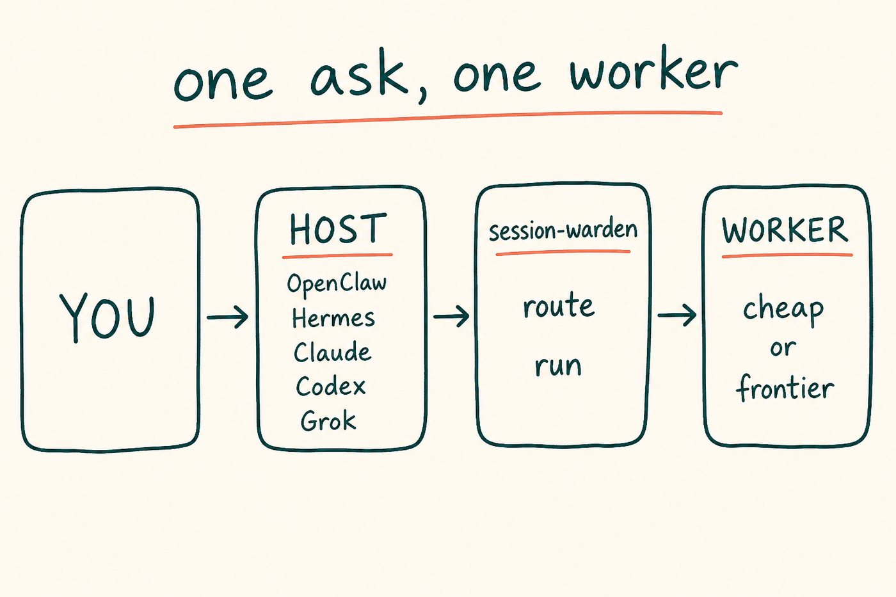
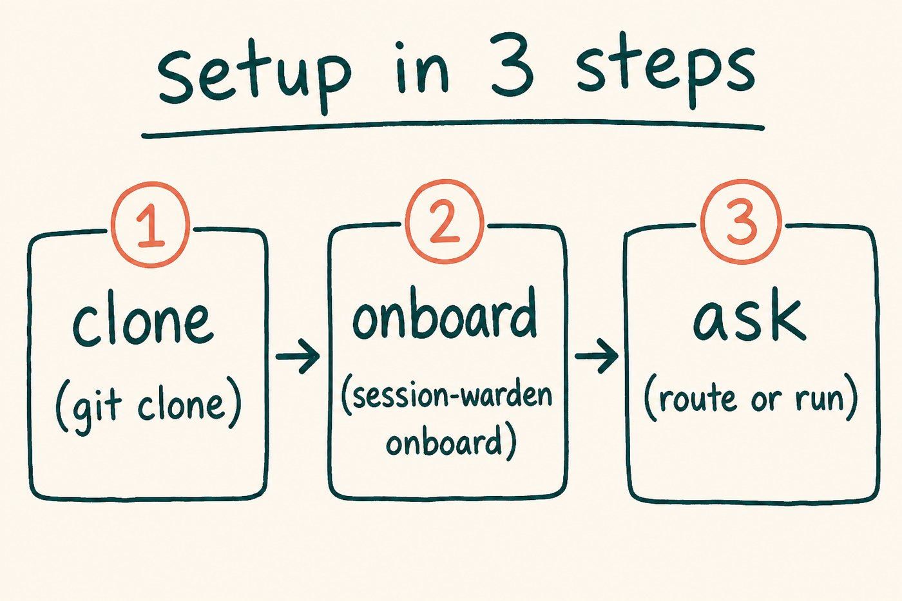
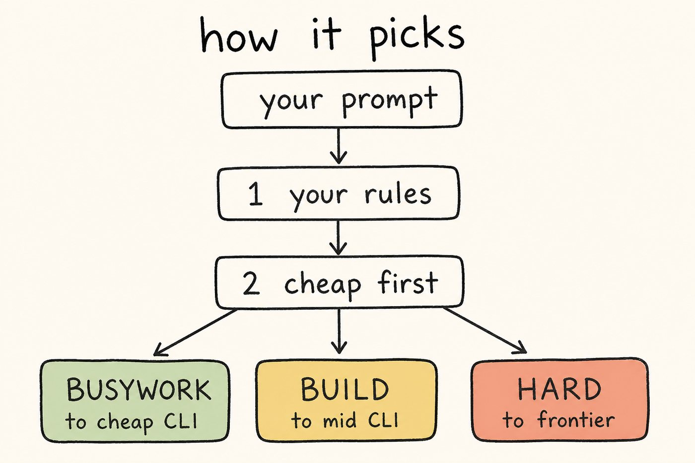
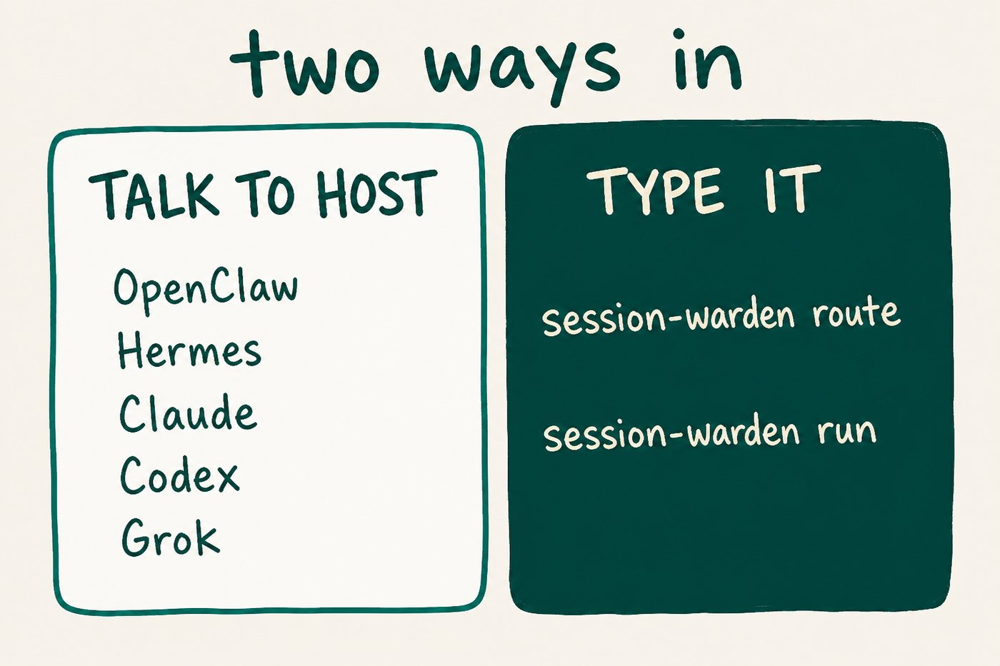
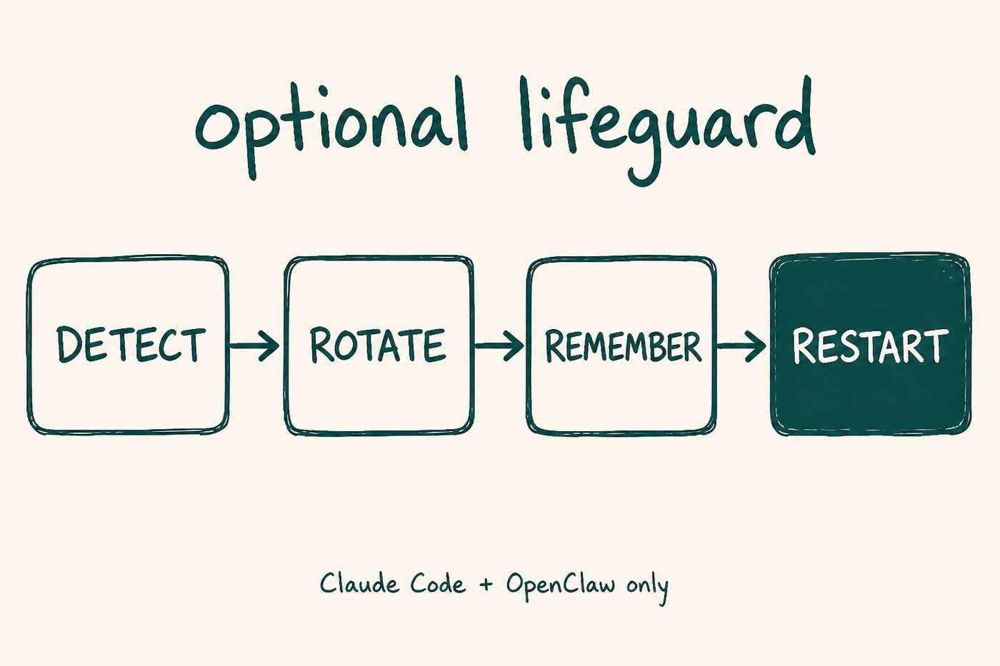

<p align="center">
  
</p>

<h1 align="center">session-warden</h1>

<p align="center"><strong>You talk. Warden picks who runs it. Cheap first.</strong></p>

<p align="center">
  <a href="https://github.com/Ani-HQ/session-warden/actions/workflows/ci.yml"></a>
  <a href="LICENSE"></a>
</p>

<p align="center"></p>
<p align="center"></p>

<p align="center"></p>

If it runs in bash, it can be a worker.

## Setup

<p align="center"></p>

<p align="center"></p>

```bash
git clone https://github.com/Ani-HQ/session-warden.git ~/session-warden
cd ~/session-warden
./bin/session-warden onboard
./bin/session-warden route --task "fix the typo in README" --json
```

That is the whole install. No OpenClaw. No cron.

A typo should pick a **cheap** worker when one is on PATH. Then do the work:

```bash
./bin/session-warden run --task "fix the typo in README"
```

More detail: [docs/onboard.md](docs/onboard.md).

## Where credits go

<p align="center"></p>

Pay pennies for lists. Keep Claude for hard.

## How it picks

<p align="center"></p>

Your `routing.yaml` wins. Otherwise cheapest capable worker. Pin a rule:

```bash
cp config/routing.yaml.example config/routing.yaml
./bin/session-warden route --task "audit auth" --path src/security/auth.go --json
```

[docs/routing.md](docs/routing.md)

## Two ways in

<p align="center"></p>

`onboard` drops a skill into OpenClaw / Hermes / Claude Code / Codex / Grok so the host calls warden for you. Or skip the host and type the commands.

## Optional: keep a Claude session alive

<p align="center"></p>

```bash
bash install.sh          # review config/thresholds.env
bash install.sh          # second run wires cron
```

Claude Code sessions only. Full story: [docs/manual.md](docs/manual.md).

## Next

[onboard](docs/onboard.md) · [routing](docs/routing.md) · [integrations](docs/integrations.md) · [drawings](docs/assets/excalidraw/) · [operator manual](docs/manual.md)

```bash
bash tests/run-tests.sh
```

## License

MIT
