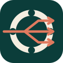
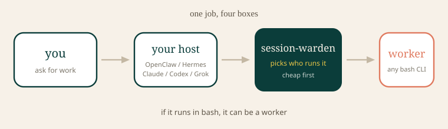
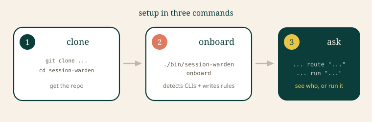
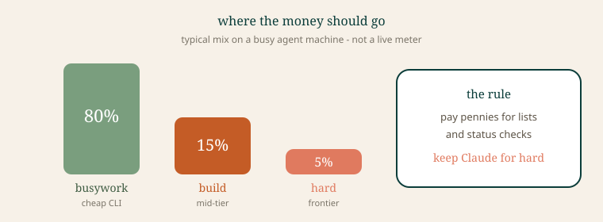
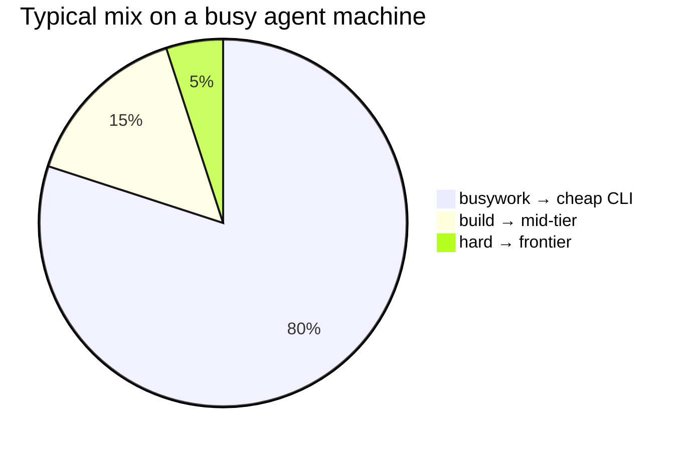
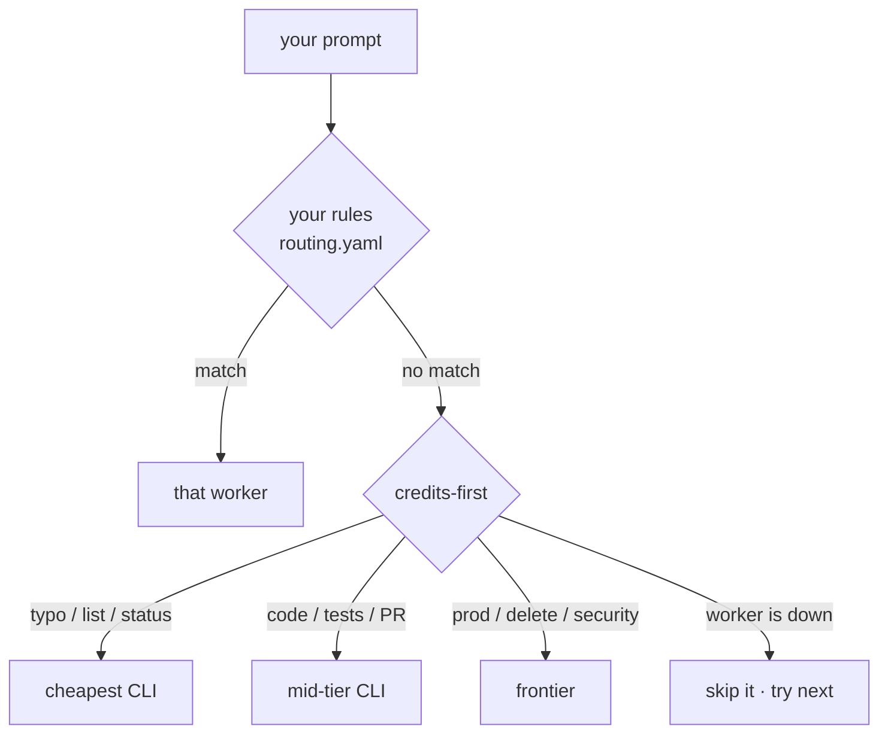
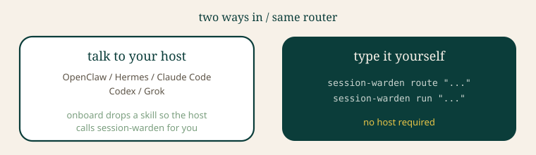
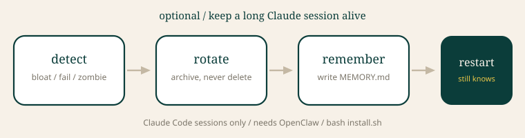

<p align="center">
  
</p>

<h1 align="center">session-warden</h1>

<p align="center">
  <strong>You talk. Warden picks who runs it. Cheap first.</strong>
</p>

<p align="center">
  <a href="https://github.com/Ani-HQ/session-warden/actions/workflows/ci.yml"></a>
  <a href="LICENSE"></a>
  
</p>

<p align="center"></p>
<p align="center"></p>

<p align="center"></p>

Anthropic extra quota is gone. Keep frontier models for hard work. Send typos, lists, and status checks to a cheap CLI.

If it runs in bash, it can be a worker.

## Setup

<p align="center"></p>

<p align="center"></p>

```bash
git clone https://github.com/Ani-HQ/session-warden.git ~/session-warden
cd ~/session-warden

./bin/session-warden onboard --dry-run   # peek first
./bin/session-warden onboard             # write rules + host skills

./bin/session-warden workers             # what is actually on PATH
./bin/session-warden route --task "fix the typo in README" --json
```

That is the whole install for the router. No OpenClaw. No cron. No config file unless you want one.

A typo / summarize / format ask should pick a **cheap** worker when one is installed. Architecture / security / “use frontier” stays on a harness.

```bash
# do the work (route, then invoke; one fallback if the first CLI fails)
./bin/session-warden run --task "fix the typo in README"
```

Add `~/session-warden/bin` to your PATH if you want the short command.

Stuck? [docs/onboard.md](docs/onboard.md) is the walkthrough.

## Did it work?

`route --json` should look like this for a typo when a cheap CLI is on PATH:

```json
{
  "worker": "deepseek-chat",
  "reason": "credits-first",
  "complexity": "low"
}
```

If every worker is missing, `workers` prints an empty list. Install any one of `claude`, `codex`, `kimi`, `grok`, `deepseek`, or `glm`, then try again.

## Where credits go

<p align="center"></p>



Not a live meter. The point: pay pennies for lists. Keep Claude for hard.

## How it picks

<p align="center"></p>



Your file wins. Heuristics are a keyword check — not an extra LLM call.

```bash
cp config/routing.yaml.example config/routing.yaml
# then pin e.g. **/security/** → claude-code
./bin/session-warden route --task "audit auth" --path src/security/auth.go --json
```

Rule language: [docs/routing.md](docs/routing.md).

## Two ways in

<p align="center"></p>

| I have… | Do this | What you get |
|---|---|---|
| Claude Code, Codex, Grok, or Hermes | `session-warden onboard` | Router + a short skill inside that host |
| Just a terminal | `session-warden route` / `run` | Same router. No host required |
| An [OpenClaw](https://github.com/openclaw/openclaw) fleet | `onboard`, then `bash install.sh` (twice) | Router for every ask · lifeguard for long Claude sessions |

`install.sh` exits without OpenClaw. That is on purpose.

## Optional: keep a Claude session alive

<p align="center"></p>

This half is Claude Code sessions only. It does **not** rotate Codex / Kimi / Grok sessions.

```bash
bash install.sh
# review config/thresholds.env, then run install.sh again
```

Full story: [docs/manual.md](docs/manual.md).

## Next

| I want to… | Go here |
|---|---|
| Understand a host skill | [docs/onboard.md](docs/onboard.md) |
| Write a routing rule or add a CLI | [docs/routing.md](docs/routing.md) |
| Plug in another runtime | [docs/integrations.md](docs/integrations.md) |
| Edit the drawings | [docs/assets/excalidraw/](docs/assets/excalidraw/) |
| Run rotation, memory, burn, doctor… | [docs/manual.md](docs/manual.md) |

```bash
bash tests/run-tests.sh
```

## License

MIT
